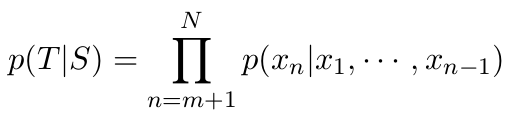

# DialoGPT

생성 일시: 2022년 12월 18일 오후 8:41
진행: 진행
태그: class

- DialoGPT는 Reddit comment chain에서 추출된 1억 4천 7백만 개 대화형 코멘트에 학습된 GPT-2 기반의 네트워크이다.
- DialoGPT는 conversational neural response generation을 다루기 위해서 GPT-2를 추가적으로 학습한 것을 의미한다.
- 구조는 GPT-2와 동일하며, multi-turn dialogue를 하나의 text로 간주하여 이전의 텍스트들이 주어졌을 때, 다음에 올 텍스트를 예측하며 텍스트를 생성한다.
- 이를 수식으로 나타내면 다음과 같다.
  
    
    

---

### DialoGPT fine-tuning

- Persona chat dataset을 dialoGPT에 fine-tuning하여 페르소나 정보를 담고 있는 대화 생성을 진행하는지 확인
- 3 epoch 학습시켰을 때의 결과는 inference.ipynb 파일에 담겨있습니다.
- 추가적인 학습을 통해서 페르소나 정보를 잘 기억하면서도 대화를 잘 할 수 있게 하는 방안을 찾아볼 예정입니다.

fine-tuning code 참고 깃헙: https://github.com/illidanlab/personaGPT

용량 크기의 문제로, 학습된 모델과 데이터는 올리지 못했습니다. inference.ipynb을 통해 학습된 모델의 결과를 확인해주시면 감사하겠습니다.